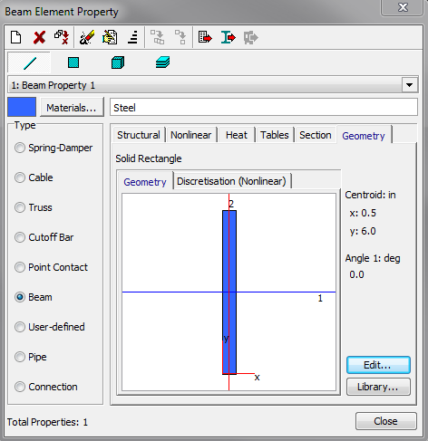
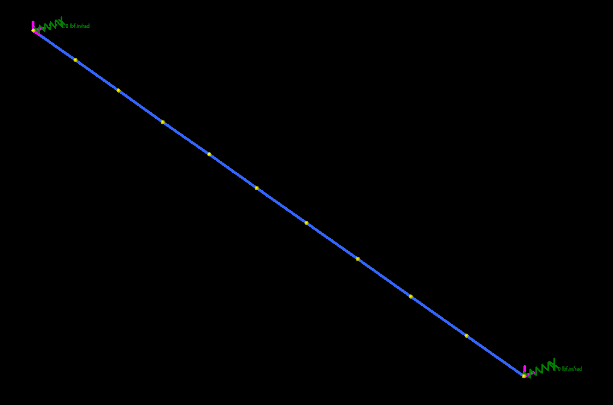

# Beam1 Strand7 Model

## Model Building
The structure is a simply supported, steel beam that is 10' long.

The beam has a rectangular cross-section of 1x12".

Rotational springs (1.0 lb.in/rad) were added at each end. The springs were applied at nodes **1** and **11**.

## Sensitivity Study
